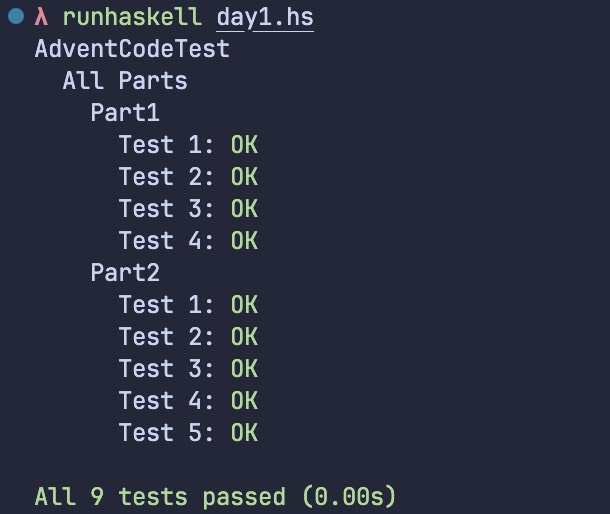

# AdventCode

There is some Practice with `Haskell`.

## Getting Started

### Test

```bash
 runhaskell day1.hs test
```

### Get OutPut

```bash
 runhaskell day1.hs
```

## Thoughts

### Day 1

It uses the `rotate`, which is used in most algorithm problems.
I use a trick solution :blush:

### Day 2

It need to know how to solve the `Matrix` datastructure or **2D** structure.
:smiley:

### Day 3

It's too hard for me to implement spiral and i founded abstract to practice is a long way.
the second part make me hard. it use the _hashmap_ and more high order function to make it elegant.

## ScreenShots



## Help

some code was helped by `OpenAI ChatGPT`. because i am not familiar with **Haskell** :blush:.

## License

MIT
